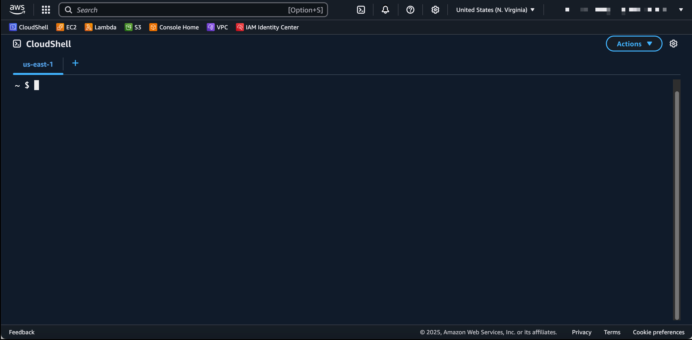

# Code Server DevBox - CloudFormation Deployment

Este template de CloudFormation despliega un entorno completo de desarrollo con Code Server en AWS, incluyendo roles IAM personalizados y configuración completa de seguridad.

## 📋 Tabla de Contenidos

- [Descripción](#descripción)
- [Arquitectura](#arquitectura)
- [Diferencias con AWS Academy](#diferencias-con-aws-academy)
- [Prerrequisitos](#prerrequisitos)
- [Parámetros del Template](#parámetros-del-template)
- [Despliegue](#despliegue)
- [Post-Despliegue](#post-despliegue)
- [Gestión del Stack](#gestión-del-stack)
- [Troubleshooting](#troubleshooting)
- [Seguridad](#seguridad)

## 📖 Descripción

Este stack crea una infraestructura completa que incluye:
- **Instancia EC2** con Ubuntu 22.04 LTS
- **Code Server** (VS Code en el navegador) con extensiones preinstaladas
- **CloudFront Distribution** para acceso seguro y optimizado
- **Roles y políticas IAM** personalizados con permisos SSM
- **Security Groups** configurados para acceso desde CloudFront
- **Herramientas de desarrollo**: Docker, Terraform, AWS CLI, Node.js, Python

## 🏗 Arquitectura

```
Internet → CloudFront → EC2 (Code Server + IAM Role) → AWS Services
```

**Recursos creados:**
- 1x EC2 Instance (t3.medium por defecto)
- 1x IAM Role con políticas SSM
- 1x IAM Instance Profile
- 1x Security Group
- 1x CloudFront Distribution
- 1x Security Group Ingress Rule

## 🔄 Diferencias con AWS Academy

| Característica | Template Principal | AWS Academy |
|----------------|-------------------|-------------|
| **IAM Role** | Crea rol personalizado | Usa `LabInstanceProfile` existente |
| **Permisos** | Políticas SSM completas | Limitado por Academy |
| **Flexibilidad** | Control total de permisos | Restringido por laboratorio |
| **Uso recomendado** | Cuentas AWS regulares | Solo AWS Academy Labs |

## ✅ Prerrequisitos

- **Cuenta AWS** con permisos administrativos
- Permisos para crear recursos de CloudFormation
- Permisos para crear roles y políticas IAM
- Navegador web moderno
- (Opcional) VPC y Subnet personalizadas

## ⚙ Parámetros del Template

| Parámetro | Descripción | Valor por defecto | Notas |
|-----------|-------------|-------------------|-------|
| `InstanceType` | Tipo de instancia EC2 | `t3.medium` | Recomendado para desarrollo |
| `RootVolumeSize` | Tamaño del disco raíz (GB) | `15` | Mínimo recomendado |
| `VSCodeServerVersion` | Versión de Code Server | `4.91.1` | Versión estable |
| `VPCID` | ID de VPC personalizada | `""` | Opcional, usa VPC por defecto si está vacío |
| `SubnetID` | ID de Subnet personalizada | `""` | Opcional, usa subnet por defecto si está vacío |
| `InternetCidrBlock` | Bloque CIDR para acceso | `0.0.0.0/0` | Restringir en producción |

## 🚀 Despliegue

### Opción 1: AWS CloudShell (Recomendada)

1. **Abrir CloudShell**
   - Ve a [AWS CloudShell](https://console.aws.amazon.com/cloudshell)
   
   

2. **Descargar el template**
   ```bash
   wget -O code-server-stack.yaml \
     https://raw.githubusercontent.com/yosoyfunes/code-server-devbox/refs/heads/main/cloudformation/code-server-stack.yaml
   ```

3. **Crear el stack**
   ```bash
   aws cloudformation create-stack \
     --stack-name code-server-stack \
     --template-body file://code-server-stack.yaml \
     --capabilities CAPABILITY_NAMED_IAM
   ```

4. **Verificar el progreso**
   ```bash
   aws cloudformation describe-stacks \
     --stack-name code-server-stack \
     --query 'Stacks[0].StackStatus'
   ```

### Opción 2: AWS CLI Local

Si tienes AWS CLI configurado localmente:

```bash
aws cloudformation create-stack \
  --stack-name code-server-stack \
  --template-body file://code-server-stack.yaml \
  --capabilities CAPABILITY_NAMED_IAM
```

### Opción 3: Consola de AWS

1. Ve a **CloudFormation** en la consola de AWS
2. Haz clic en **Create stack**
3. Sube el archivo `code-server-stack.yaml`
4. Configura los parámetros según tus necesidades
5. **Importante**: Marca la casilla "I acknowledge that AWS CloudFormation might create IAM resources"
6. Revisa y crea el stack

## 🎯 Post-Despliegue

### Obtener la URL de acceso

```bash
aws cloudformation describe-stacks \
  --stack-name code-server-stack \
  --query 'Stacks[0].Outputs[?OutputKey==`VSCodeServerCloudFrontDomainName`].OutputValue' \
  --output text
```

### Credenciales de acceso

- **URL**: La URL de CloudFront obtenida arriba
- **Contraseña**: `devcontainer` (por defecto)

### Verificar el despliegue

1. **Verificar estado del stack**:
   ```bash
   aws cloudformation describe-stack-events \
     --stack-name code-server-stack \
     --max-items 10
   ```

2. **Verificar instancia EC2**:
   ```bash
   aws ec2 describe-instances \
     --filters "Name=tag:aws:cloudformation:stack-name,Values=code-server-stack" \
     --query 'Reservations[*].Instances[*].[InstanceId,State.Name,PublicIpAddress]'
   ```

3. **Verificar rol IAM creado**:
   ```bash
   aws iam get-role --role-name $(aws cloudformation describe-stack-resources \
     --stack-name code-server-stack \
     --query 'StackResources[?ResourceType==`AWS::IAM::Role`].PhysicalResourceId' \
     --output text)
   ```

## 🔧 Gestión del Stack

### Actualizar el stack

```bash
aws cloudformation update-stack \
  --stack-name code-server-stack \
  --template-body file://code-server-stack.yaml \
  --capabilities CAPABILITY_NAMED_IAM
```

### Eliminar el stack

```bash
aws cloudformation delete-stack \
  --stack-name code-server-stack
```

### Verificar eliminación

```bash
aws cloudformation describe-stacks \
  --stack-name code-server-stack
```

## 🔍 Troubleshooting

### Errores comunes

**Error: "Stack already exists"**
```bash
# Verificar stacks existentes
aws cloudformation list-stacks --stack-status-filter CREATE_COMPLETE UPDATE_COMPLETE

# Eliminar stack existente si es necesario
aws cloudformation delete-stack --stack-name code-server-stack
```

**Error: "User is not authorized to perform: iam:CreateRole"**
- Verificar que tienes permisos administrativos o permisos específicos de IAM
- Asegurar que usas `--capabilities CAPABILITY_NAMED_IAM`

**Error: "No default VPC for this user"**
```bash
# Crear VPC por defecto si no existe
aws ec2 create-default-vpc
```

**Code Server no responde**
```bash
# Obtener ID de la instancia
INSTANCE_ID=$(aws cloudformation describe-stack-resources \
  --stack-name code-server-stack \
  --query 'StackResources[?ResourceType==`AWS::EC2::Instance`].PhysicalResourceId' \
  --output text)

# Verificar logs de la instancia
aws ec2 get-console-output --instance-id $INSTANCE_ID

# Conectar por SSM para diagnosticar
aws ssm start-session --target $INSTANCE_ID
```

### Verificar logs

```bash
# Ver eventos del stack
aws cloudformation describe-stack-events --stack-name code-server-stack

# Ver recursos del stack
aws cloudformation describe-stack-resources --stack-name code-server-stack
```

## 🔒 Seguridad

### Configuración actual

- **Acceso**: Solo desde CloudFront (no acceso directo a EC2)
- **Puerto**: 80 (HTTP) - CloudFront maneja HTTPS
- **Autenticación**: Contraseña básica (`devcontainer`)
- **IAM**: Rol personalizado con permisos SSM para administración

### Recomendaciones de seguridad

1. **Cambiar contraseña por defecto**:
   ```bash
   # Obtener ID de la instancia
   INSTANCE_ID=$(aws cloudformation describe-stack-resources \
     --stack-name code-server-stack \
     --query 'StackResources[?ResourceType==`AWS::EC2::Instance`].PhysicalResourceId' \
     --output text)
   
   # Conectar a la instancia usando SSM
   aws ssm start-session --target $INSTANCE_ID
   
   # Una vez conectado, editar el archivo de configuración
   sudo nano /home/ubuntu/.config/code-server/config.yaml
   
   # Cambiar la línea hashed-password con una nueva contraseña hasheada
   # Para generar un hash de contraseña:
   echo -n "tu_nueva_contraseña" | npx argon2-cli -e
   
   # Reiniciar el servicio
   sudo systemctl restart code-server@ubuntu
   ```

2. **Restringir acceso por IP**:
   - Modificar el parámetro `InternetCidrBlock` con tu IP específica

3. **Usar HTTPS**:
   - CloudFront proporciona HTTPS automáticamente

4. **Monitoreo**:
   - Revisar CloudTrail para actividad sospechosa
   - Configurar alertas de CloudWatch

5. **Gestión de permisos IAM**:
   ```bash
   # Revisar políticas del rol creado
   aws iam list-attached-role-policies --role-name <ROLE-NAME>
   
   # Ver detalles de las políticas
   aws iam get-policy --policy-arn arn:aws:iam::aws:policy/service-role/AmazonEC2RoleforSSM
   ```

---

## 📚 Recursos adicionales

- [Documentación de Code Server](https://coder.com/docs/code-server)
- [AWS CloudFormation User Guide](https://docs.aws.amazon.com/cloudformation/)
- [AWS IAM Best Practices](https://docs.aws.amazon.com/IAM/latest/UserGuide/best-practices.html)
- [AWS Systems Manager Session Manager](https://docs.aws.amazon.com/systems-manager/latest/userguide/session-manager.html)

---

**Nota**: Para uso en AWS Academy, utiliza el template específico en la carpeta `AWS_Academy/` que está optimizado para trabajar con el rol `LabInstanceProfile`.